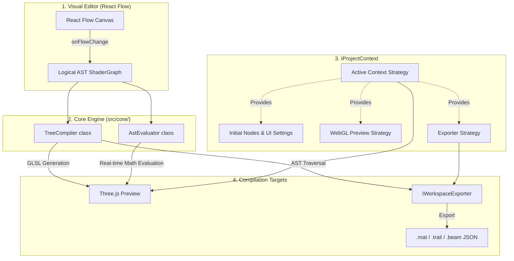

Markdown

# Cosmos Engine Architecture

This document outlines the high-level design of the Cosmos Node Editor. It is intended for developers who wish to understand the internal data flow or extend the engine's capabilities without breaking existing logic.

## 1. The Cosmos Pipeline

At its core, Cosmos is a visual compiler. The application strictly follows a unidirectional data flow, separating visual state from mathematical logic.

## 2. Core Modules (Folder Structure)

To keep the engine scalable, responsibilities are strictly divided by folder:

* **`src/components/`**: Pure UI. Contains React Flow components, modals, toolbars, and layout logic. Absolutely *no* compiler or AST evaluation logic goes here.
* **`src/core/`**: The brains of the engine.
    * **`compiler/`**: Contains the `TreeCompiler` (string generation for GLSL & Java) and `AstEvaluator` (real-time TypeScript math execution for 3D previews).
    * **`contexts/`**: The state and behavior definitions for specific environments (Material, Trail, Beam).
    * **`shapes/`**: Geometry generators for the WebGL canvas.
    * **`exporter/`**: Logic for packing the AST into game-ready JSON formats.
* **`src/types/`**:  All TypeScript interfaces (`ShaderGraph`, `IProjectContext`, `NodeDefinition`) live here.

---

## 3. How to Extend Cosmos

Cosmos adheres to the **Open-Closed Principle (OCP)** , and we try to respect it!. The core engine (`App.tsx`, `Canvas3D.tsx`) is closed for modification, but the system is open for extension via interfaces. Never use hardcoded `if (context === '...')` checks in the core engine, this kills extensibility.

### A. Adding a New Node Type

Nodes are entirely data-driven. To add a new mathematical operation or input:

1. **Define the ID:** Add the new type string to the `NodeType` union in `src/types/ast.ts`.
2. **Define the Node:** Add an entry to `NODE_DEFINITIONS` in `src/core/NodeDefinitions.ts`. Specify the inputs, outputs, UI controls (like sliders or color pickers), and the header color.
3. **Define the Strategy:** Implement the compilation logic in `src/core/registry.ts`. It must define how the node generates GLSL (`generateGLSL`) and how it calculates its value mathematically in real-time (`evaluate`).
*Note: The UI will automatically generate the visual block based on the definition. A custom React component is not needed unless it requires a highly specialized UI.*

### B. Adding a New Context (e.g., Particles, Skybox)

A Context defines a specific visual environment. To create one:

1. Create a new file in `src/core/contexts/` (e.g., `ParticleContext.tsx`).
2. Implement the `IProjectContext` interface (`src/types/context.ts`).
3. Define its behavioral flags:
    * `requiresGlobalMaterial`: Does it need the base material shader, or does it compile its own?
    * `isOrthographic`: Does it need a 2D camera?
4. Implement `createPreviewStrategy()` to dictate how Three.js should render the environment (setup meshes, apply evaluator logic to vertices, etc.).
5. Add the new context to the `AVAILABLE_CONTEXTS` array at the top of `src/App.tsx`. The entire application will dynamically adapt to support it.

### C. Adding or Modifying Exporters

Exporters translate the abstract node graph into strict JSON metadata for the target game engine (like Minecraft Forge).

1. Implement the `IWorkspaceExporter` interface (`src/types/export.ts`).
2. Write the logic to traverse the `ShaderGraph` and build a file matching the `CosmosMetadata` schema.
3. Link the exporter to the context by returning an instance of it in the context's `getExporter()` method.
4. The `useWorkspaceIO` hook will automatically handle saving, zipping, and downloading the files when the "Export" action is triggered.
